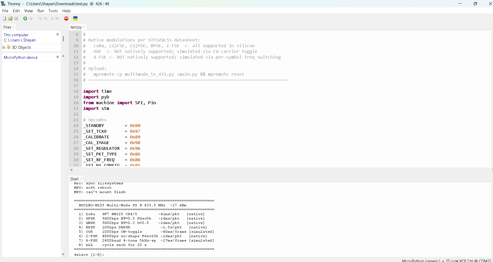
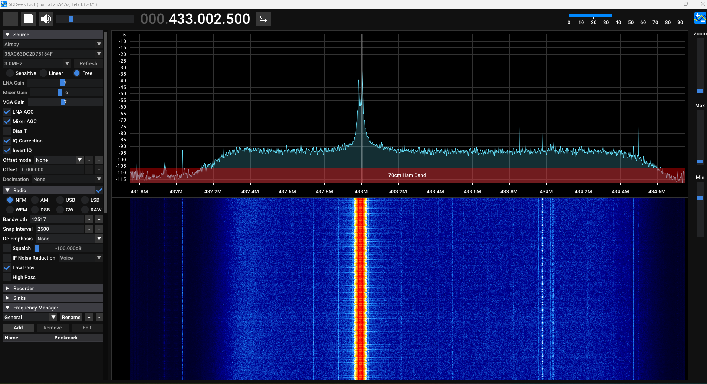
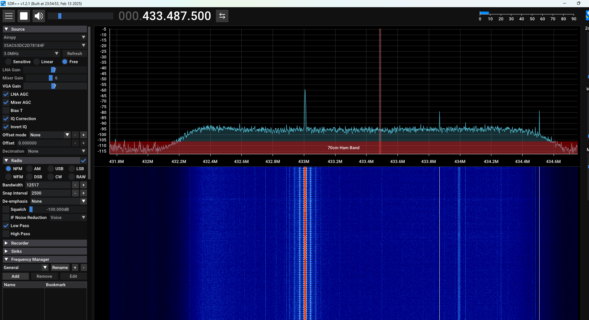
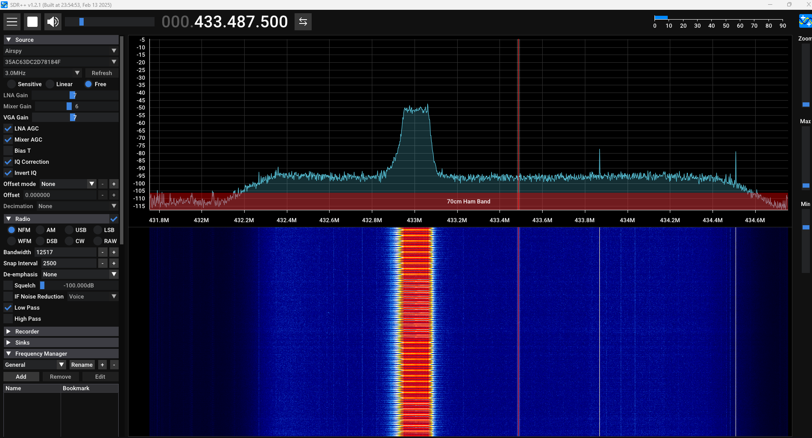

# NUCLEO-WL55 MicroPython Radio Examples

Multi-mode Sub-GHz transmitter for the **ST NUCLEO-WL55JC** board using MicroPython.
Supports **LoRa, GFSK, GMSK, BPSK, 2-FSK, 4-FSK, and OOK** modulations at 433.5 MHz via the STM32WL55's built-in SX126x-compatible radio.

---

## Table of Contents

- [Hardware Required](#hardware-required)
- [Step 1 — Flash MicroPython Firmware](#step-1--flash-micropython-firmware)
- [Step 2 — Set Up Thonny IDE](#step-2--set-up-thonny-ide)
- [Step 3 — Prepare the Filesystem](#step-3--prepare-the-filesystem)
- [Step 4 — Install Dependencies](#step-4--install-dependencies)
- [Step 5 — Upload and Run Examples](#step-5--upload-and-run-examples)
- [Modulation Modes Reference](#modulation-modes-reference)
- [Troubleshooting](#troubleshooting)
- [License](#license)

---

## Hardware Required

| Item | Notes |
|------|-------|
| NUCLEO-WL55JC1 | Rev C or Rev D (MB1389) |
| USB-A to Micro-USB cable | **Data cable** — charge-only cables will not work |
| 433 MHz antenna (optional) | SMA connector; board antenna tuned for 868/915 MHz |

> ⚠️ **Always attach an antenna before transmitting.** Running the PA without a load can damage the RF front-end.

---

## Step 1 — Flash MicroPython Firmware

### 1.1 Download the firmware

Go to the official MicroPython download page and grab the latest `.hex` file for the NUCLEO-WL55:

```
https://micropython.org/download/NUCLEO_WL55/
```

Download **`NUCLEO_WL55-YYYYMMDD-vX.XX.X.hex`** (latest stable release).

---

### 1.2 Install STM32CubeProgrammer

Download and install from ST's website:

```
https://www.st.com/en/development-tools/stm32cubeprog.html
```

Supports Windows, macOS, and Linux.

---

### 1.3 Connect the board

1. Plug the Micro-USB cable into the **ST-Link USB port** (labelled **CN1** — the port near the ST-Link chip, not the user USB port).
2. The board should enumerate as a USB device and be recognised by your OS.

---

### 1.4 Flash the firmware

**Using the STM32CubeProgrammer GUI:**

1. Open **STM32CubeProgrammer**.
2. In the top-right connection panel set:
   - **Interface:** `ST-LINK`
   - **Port:** `SWD`
   - **Mode:** `Normal`
3. Click **Connect**. Device information should appear in the memory panel.  
   > If connection fails, hold the **RESET** button on the board, click **Connect**, then release RESET.
4. Go to the **Erasing & Programming** tab (chip icon with down arrow).
5. Under **File Path**, click **Browse** and select the `.hex` file you downloaded.
6. Check both:
   - ✅ **Verify programming**
   - ✅ **Run after programming**
7. Click **Start Programming**.
8. Wait for the green success banner, then click **Disconnect**.

**Using the command line (optional):**

```bash
STM32_Programmer.sh -c port=SWD -d firmware.hex -hardRst
```

On Windows use `STM32_Programmer_CLI.exe` instead.

---

### 1.5 Verify the flash

Open any serial terminal (PuTTY, screen, minicom) at **115200 baud** on the board's COM port.
Press **Ctrl+D** (soft reset). You should see:

```
MicroPython v1.27.0 on 2025-12-09; NUCLEO-WL55 with STM32WL55JCI7
Type "help()" for more information.
>>>
```

---

## Step 2 — Set Up Thonny IDE

### 2.1 Install Thonny

Download from [https://thonny.org](https://thonny.org) and install for your OS.

---

### 2.2 Configure the interpreter

1. Open Thonny.
2. Go to **Tools → Options → Interpreter**.
3. Set **"Which interpreter or device"** to:  
   `MicroPython (generic)`
4. Set **Port** to the NUCLEO-WL55 COM port:
   - **Windows:** `COM3` (or similar — check Device Manager)
   - **Linux / macOS:** `/dev/ttyACM0`
5. Click **OK**.

---

### 2.3 Confirm connection

The **Shell** panel at the bottom of Thonny should show the MicroPython REPL prompt `>>>`.  
If it is blank, click the **Stop/Restart** button (red circle) in the toolbar.

---

## Step 3 — Prepare the Filesystem

The NUCLEO-WL55 has only **~24 KB** of available flash for user files. Before uploading scripts you must format the filesystem.

In the Thonny Shell, run:

```python
import os, pyb
os.VfsLfs2.mkfs(pyb.Flash(start=0))
```

Then press **Ctrl+D** to soft-reset. On restart you will see `/flash` mounted with no errors.

> You only need to do this **once**. It survives power cycles.

---

## Step 4 — Install Dependencies

### 4.1 Install mpremote

The NUCLEO-WL55 rejects file uploads larger than ~1 KB through Thonny's built-in file manager. Use **mpremote** from the command line instead.

```bash
pip install mpremote
```

Verify it sees the board:

```bash
mpremote connect list
```

---

### 4.2 [Optional, not required for this tutorial] Install the LoRa library (for LoRa mode only)

```bash
mpremote mip install lora-sync
mpremote mip install lora-stm32wl55
```

> The `lora` library is only needed if you want to use the high-level LoRa API separately.  
> The multi-mode transmitter script in this repo uses **raw register access** and has **no external dependencies** for GFSK, GMSK, BPSK, 2-FSK, 4-FSK, or OOK modes.

---

## Step 5 — Upload and Run Examples

### 5.1 Clone this repository

```bash
git https://github.com/ShayanMajumder/STM32WL-MicroPython-Radio-examples.git
cd STM32WL-MicroPython-Radio-examples
```

---

### 5.2 Upload a script [Not Recommended check 5.3]

Use `mpremote` to copy a script to the board as `main.py` (runs automatically on boot):

```bash
# Multi-mode transmitter (all modulations)
mpremote cp multimode_tx_433.py :main.py

# Reset the board to start execution
mpremote reset
```

---

### 5.3 Run interactively in Thonny [Recommended]

For quick testing without saving to the board:

1. Open the script file in Thonny.
2. Press **F5** or click the **Run** button.
3. When prompted, choose **"This computer"** (runs directly in the REPL session).

---

### 5.4 Using the multi-mode transmitter

On boot (or after pressing **F5**), the menu appears in the Shell:

```
========================================================
  NUCLEO-WL55 Multi-Mode TX @ 433.5 MHz  -17 dBm
========================================================
  1) LoRa   SF7 BW125 CR4/5          ~41ms/pkt   [native]
  2) GFSK   9600bps BT=0.5 Fdev=5k   ~16ms/pkt   [native]
  3) GMSK   9600bps BT=0.3 h=0.5     ~16ms/pkt   [native]
  4) BPSK   100bps DBPSK              ~1.5s/pkt   [native]
  5) OOK    1000bps CW-toggle         ~40ms/frame [simulated]
  6) 2-FSK  4800bps no-shape Fdev10k  ~16ms/pkt   [native]
  7) 4-FSK  2400baud 4-tone 5kHz-sp   ~17ms/frame [simulated]
  8) ALL    cycle each for 10 s
========================================================
Select [1-8]:
```

Type a number and press **Enter**. The selected mode transmits continuously for **10 seconds** then repeats. Press **Ctrl+C** to stop at any time.

**Example output (GFSK mode):**

```
>>> GFSK - 10 s <<<
[INIT] GFSK  9600bps BT=0.5 Fdev=5kHz @ 433.500 MHz  -17 dBm
  [GFSK #0000]
  [GFSK #0001]
  [GFSK #0002]
  ...
>>> GFSK done - 312 pkts <<<
```

---

### 5.5 GFSK-only transmitter (simple script)

```bash
mpremote cp gfsk_tx_433.py :main.py
mpremote reset
```

Transmits GFSK packets continuously with no menu.

---

## Modulation Modes Reference

| # | Mode | Type | Bit Rate | Fdev / BW | Notes |
|---|------|------|----------|-----------|-------|
| 1 | **LoRa** | Spread spectrum | ~5.5 kbps (SF7) | BW 125 kHz | Native; longest range |
| 2 | **GFSK** | FSK | 9600 bps | 5 kHz, BT=0.5 | Native; standard IoT |
| 3 | **GMSK** | FSK | 9600 bps | 2400 Hz, BT=0.3 | Native; GSM standard, h=0.5 |
| 4 | **BPSK** | Phase shift | 100 bps | — | Native; Sigfox DBPSK |
| 5 | **OOK** | Amplitude | 1000 bps | — | Simulated via CW toggle |
| 6 | **2-FSK** | FSK | 4800 bps | 10 kHz | Native; no pulse shaping |
| 7 | **4-FSK** | FSK | 4800 bps | 4 tones × 5 kHz | Simulated via freq switching |

### Native vs Simulated

- **Native** — the STM32WL55 radio handles modulation in hardware. Packet framing, CRC, preamble and sync word are all managed by the radio IP.
- **Simulated** — MicroPython Python code manually controls the carrier to approximate the modulation. Functionally correct RF output, but timing is less precise than hardware modulation.

### Why OOK and 4-FSK are simulated

The STM32WL55 uses an SX126x-derived radio core which natively supports LoRa, (G)FSK, (G)MSK, and BPSK. OOK requires amplitude modulation of the PA which the SX126x PA architecture does not support directly. 4-FSK requires multiple simultaneous Fdev registers which the chip also does not have.

---
## Receiving

I am using SDR++ software with Airspy mini to receive below image shows waterfall of 433Mhz signals I am receiving.

##### 2-FSK


#### GMSK


#### LoRa

---
## Troubleshooting

**`MPY: can't mount flash`**  
The filesystem has not been formatted yet. Run the format command in Step 3.

**`SyntaxError: invalid syntax` on a compound statement**  
MicroPython is stricter than CPython. Avoid writing `if ...: while True: ...` on a single line — use fully indented blocks.

**`AttributeError: 'module' object has no attribute 'board'`**  
Use `machine.Pin("FE_CTRL1", ...)` with a string name, not `pyb.board.FE_CTRL1`. The `pyb.board` namespace is not present in this MicroPython build.

**File upload silently fails / board unresponsive after upload**  
The NUCLEO-WL55 has a known limitation where files larger than ~1 KB uploaded via Thonny's file manager can corrupt the REPL session. Always use `mpremote cp` for script files.


**`RuntimeError: Internal radio Status (2, 1) OpError 0x20`**  
The TCXO failed to start. Increase the TCXO startup delay in `_radio_base_init()` — change `0x40` in the `_SET_TCXO` command to `0x80` (doubling the timeout to ~2 ms).

---

## Project Structure
```
NUCLEO-WL55-SubGHz-TX/
├── Docs/
│   └── (reference materials, datasheets, app notes)
├── Examples/
│   ├── tx_lora_433.py        # LoRa — SF7 BW125 CR4/5 @ 433.5 MHz
│   ├── tx_gfsk_433.py        # GFSK — 9600 bps BT=0.5 Fdev=5 kHz
│   ├── tx_gmsk_433.py        # GMSK — 9600 bps BT=0.3 h=0.5 (native)
│   ├── tx_bpsk_433.py        # BPSK — 100 bps DBPSK Sigfox-style
│   ├── tx_ook_433.py         # OOK  — 1000 bps CW-toggle (simulated)
│   ├── tx_2fsk_433.py        # 2-FSK — 4800 bps no shaping Fdev=10 kHz
│   ├── tx_4fsk_433.py        # 4-FSK — 2400 baud 4-tone simulated
│   └── multimode_tx_433.py   # All modes in one file — interactive menu
├── Images/
│   └── (board photos, SDR screenshots, signal captures)
├── LICENSE
└── README.md
```

---

## License

MIT License. See [LICENSE](LICENSE) for details.